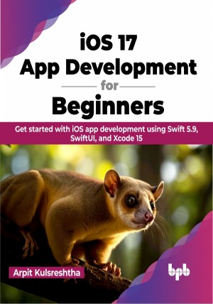

# iOS 17 App Development for Beginners 

Learn iOS app development from scratch and build your dream app

This is the repository for [iOS 17 App Development for Beginners 
](https://bpbonline.com/products/ios-17-app-development-for-beginners),published by BPB Publications.

## About the Book
“iOS 17 App Development for Beginners” is a definitive guide to building iOS apps with Swift.

This book teaches the fundamentals of Swift, laying the foundation for future app development. It covers how to develop user interfaces for iOS apps using SwiftUI and UIKit and how to write code for views, view controllers, and data managers. The book also teaches using Core Data, Swift Data, and SQLite for database storage. Additionally, it covers essential Apple technologies and frameworks, such as Core Location and MapKit for GPS tracking, Camera and Photo Library for image storage, CI/CD, and Core ML for machine learning and artificial intelligence solutions.

After completing this book, you will have a solid grasp of Swift app development and successfully publish your apps to the App Store.

## What You Will Learn
•  Explore the enhancements in the Swift programming language.

•  Discover how to seamlessly integrate and manage complex data models using SwiftData and Core Data.

•  Take a deep dive into the declarative and intuitive SwiftUI framework.

•  Learn how to integrate machine learning with Core ML into your apps.

•  Integrate ActivityKit to create engaging and interactive experiences within your iOS 17 apps.

